# Week 3: Vector Space Models

## Course Overview
**Vector space models capture semantic meaning and relationships between words. You'll learn how to create word vectors that capture dependencies between words, then visualize their relationships in two dimensions using PCA.**  
*Coursera - [DeepLearning.AI](https://www.deeplearning.ai/courses/natural-language-processing-specialization/)*

---

## Learning Objectives
- [x] [Vector Space Models](#1-vector-space-models)
- [x] [Word by Word and Word by Doc.](#2-word-by-word-and-word-by-doc)
- [x] [Euclidean Distance](#3-euclidean-distance)
- [x] [Cosine Similarity](#4-cosine-similarity)
- [x] [Manipulating Words in Vector Spaces](#5-manipulating-words-in-vector-spaces)
- [x] [Principal Component Analysis (PCA)](#6-principal-component-analysis-pca)
  - [6.1 PCA Overview](#61-pca-overview)
  - [6.2 PCA Mathematical Foundation](#62-pca-mathematical-foundation)
  - [6.3 PCA Algorithm - Detailed Implementation](#63-pca-algorithm---detailed-implementation)
  - [6.4 PCA Practical Example: 5D to 2D Projection](#64-pca-practical-example-5d-to-2d-projection)
  - [6.5 Computing Eigenvalues and Eigenvectors from Covariance Matrix](#65-computing-eigenvalues-and-eigenvectors-from-covariance-matrix)

---

## 1. Vector Space Models


---

## 2. Word by Word and Word by Doc.

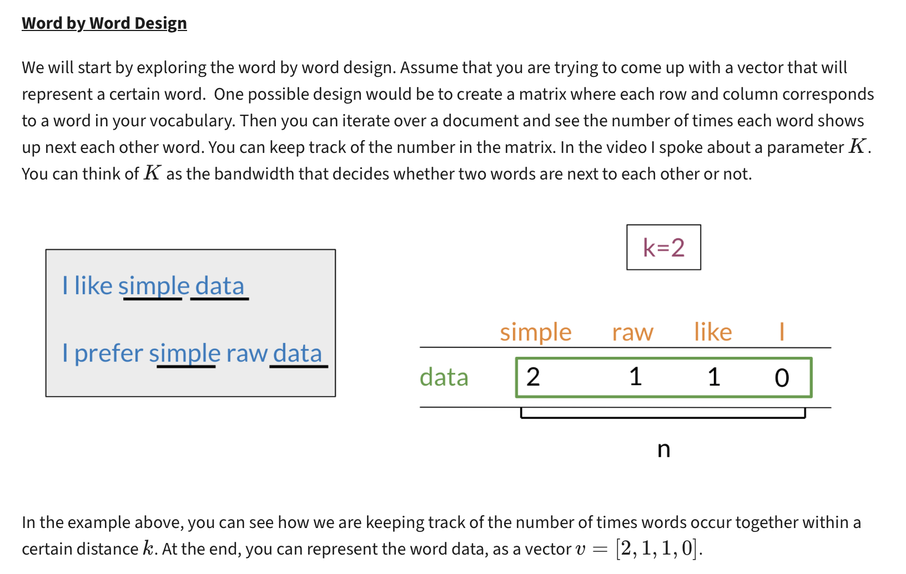
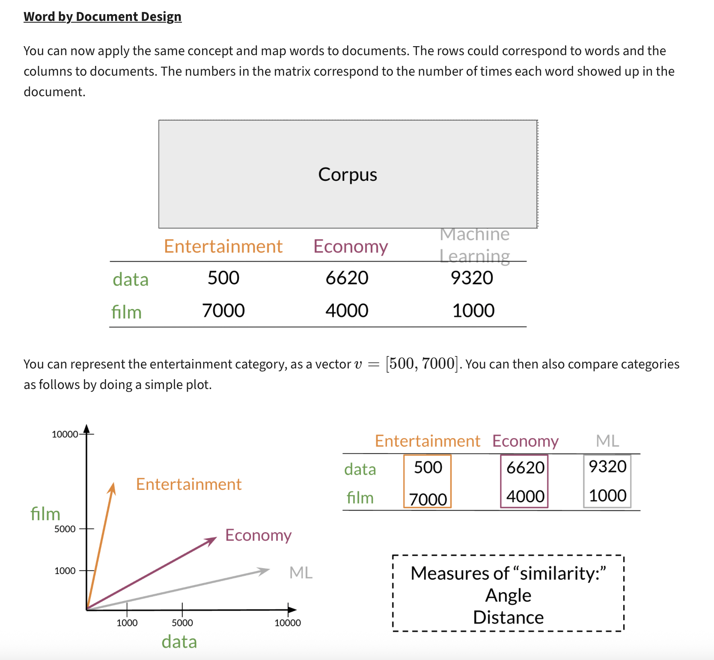

---

## 3. Euclidean Distance

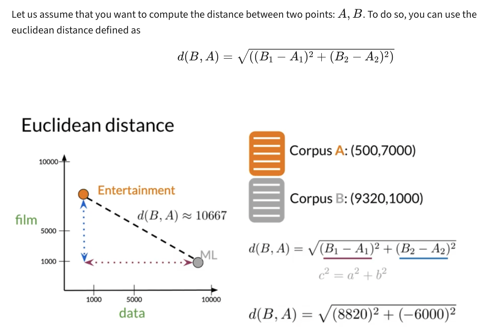
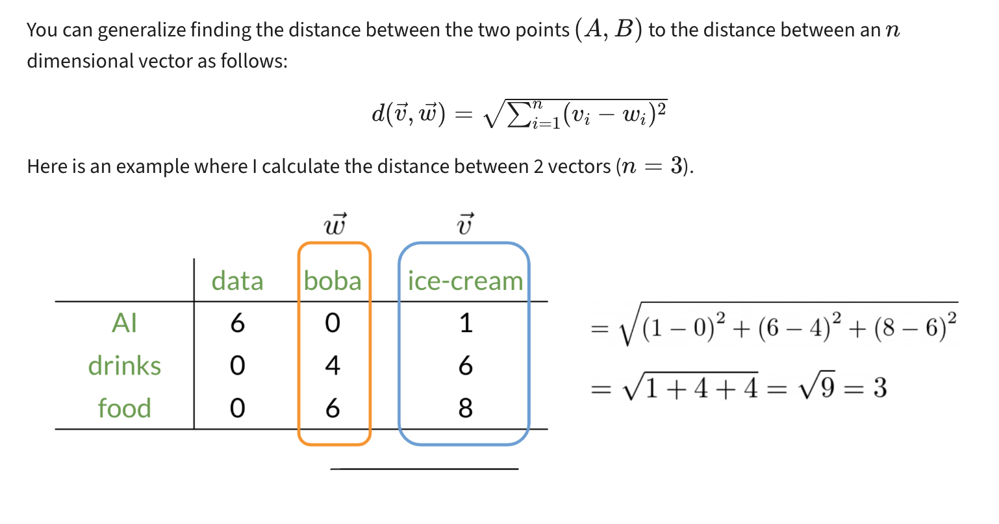


---

## 4. Cosine Similarity

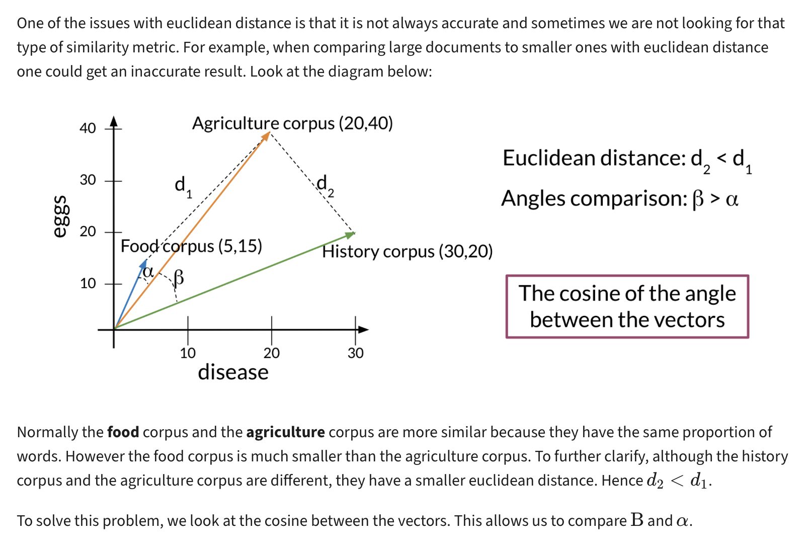
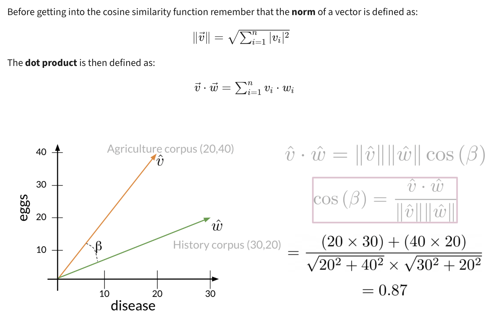
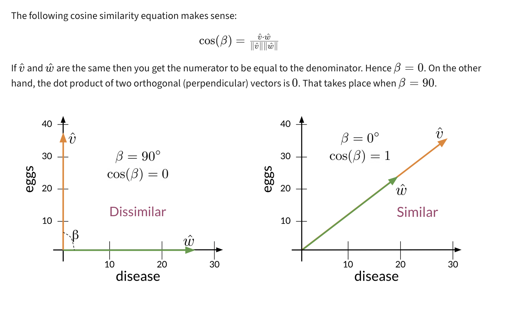


---

## 5. Manipulating Words in Vector Spaces


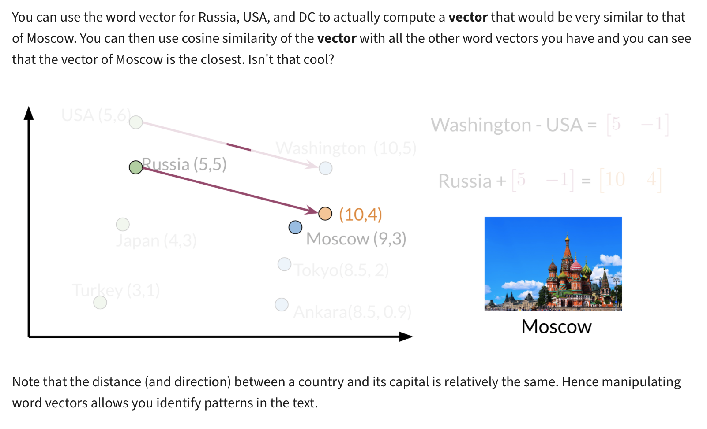


---

## 6. Principal Component Analysis (PCA)

### 6.1 PCA Overview

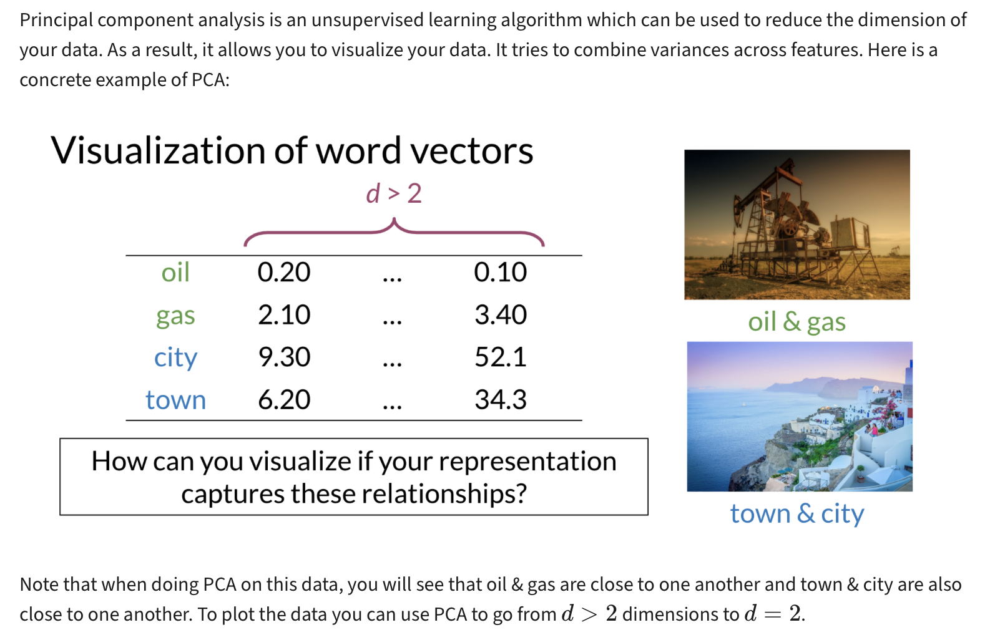
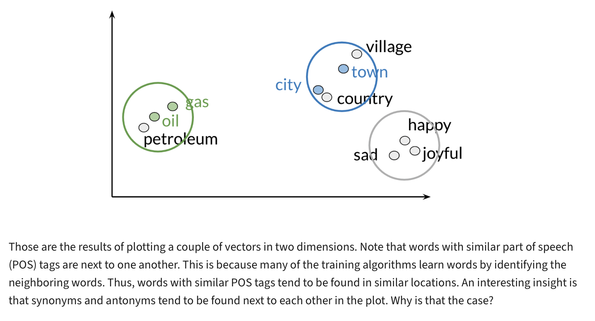

### 6.2 PCA Mathematical Foundation

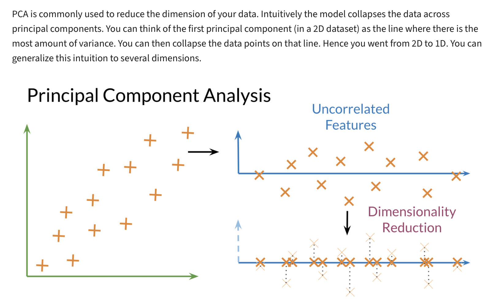
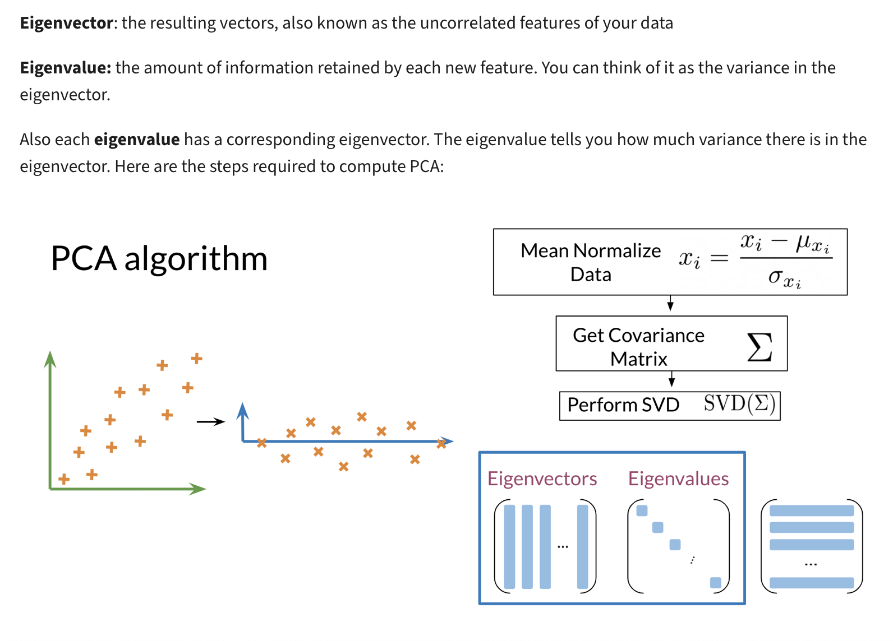
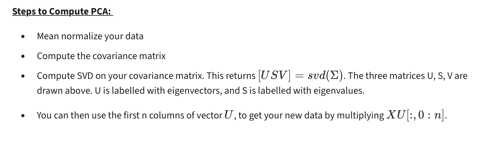

### 6.3 PCA Algorithm - Detailed Implementation

Principal Component Analysis (PCA) is a dimensionality reduction technique that transforms data to a new coordinate system where the greatest variances lie on the first axes (principal components).

#### 6.3.1 The PCA Process

**Goal**: Reduce dimensionality while preserving maximum variance in the data.

**Key Insight**: Find the directions (principal components) along which the data varies the most.

---

#### 6.3.2 Step-by-Step PCA Algorithm

##### Step 1: Standardize the Data

Given a dataset \( X \in \mathbb{R}^{n \times d} \), where:
- \( n \): number of samples
- \( d \): number of features

Center the data (zero mean):

\[
\bar{x}_j = \frac{1}{n} \sum_{i=1}^n x_{ij} \quad \text{(mean of feature } j\text{)}
\]
\[
X_{\text{centered}} = X - \bar{X}
\]

If needed, normalize the features to unit variance:

\[
x'_{ij} = \frac{x_{ij} - \bar{x}_j}{s_j} \quad \text{where } s_j \text{ is std deviation of feature } j
\]

---

##### Step 2: Compute the Covariance Matrix

\[
\Sigma = \frac{1}{n-1} X_{\text{centered}}^T X_{\text{centered}} \in \mathbb{R}^{d \times d}
\]

This matrix expresses how features vary with respect to each other.

---

##### Step 3: Eigen Decomposition of the Covariance Matrix

Solve for eigenvalues and eigenvectors:

\[
\Sigma \mathbf{v}_i = \lambda_i \mathbf{v}_i
\]

Where:
- \( \lambda_i \): eigenvalue (amount of variance explained)
- \( \mathbf{v}_i \): eigenvector (direction of principal component)

Sort eigenvalues \( \lambda_1 \ge \lambda_2 \ge \dots \ge \lambda_d \), and order corresponding eigenvectors.

---

##### Step 4: Choose \( k \) Principal Components

Decide how many components \( k \) to keep (e.g., based on cumulative variance).

Form projection matrix \( W_k \in \mathbb{R}^{d \times k} \) using the top \( k \) eigenvectors:

\[
W_k = [\mathbf{v}_1, \mathbf{v}_2, \dots, \mathbf{v}_k]
\]

---

##### Step 5: Project the Data

\[
Z = X_{\text{centered}} W_k \in \mathbb{R}^{n \times k}
\]

Here, \( Z \) is the reduced representation of the original data in the new \( k \)-dimensional space.

---

#### 6.3.3 Key PCA Formulas Summary

1. **Centering the data**:
\[
X_{\text{centered}} = X - \bar{X}
\]

2. **Covariance matrix**:
\[
\Sigma = \frac{1}{n - 1} X_{\text{centered}}^T X_{\text{centered}}
\]

3. **Eigen decomposition**:
\[
\Sigma \mathbf{v}_i = \lambda_i \mathbf{v}_i
\]

4. **Projection**:
\[
Z = X_{\text{centered}} W_k
\]

---

#### 6.3.4 Explained Variance Ratio

To evaluate how much variance each principal component retains:

\[
\text{Explained Variance Ratio} = \frac{\lambda_i}{\sum_{j=1}^d \lambda_j}
\]

This helps in selecting \( k \) components that explain most of the variance.

---

### 6.4 PCA Practical Example: 5D to 2D Projection

Let's walk through a complete PCA example with real numbers.

#### 6.4.1 Original 5D Dataset (6 samples, 5 features)

We have the following dataset \( X \in \mathbb{R}^{6 \times 5} \):

\[
X =
\begin{bmatrix}
2.5 & 2.4 & 1.5 & 2.2 & 0.5 \\
0.5 & 0.7 & 2.6 & 0.9 & 1.5 \\
2.2 & 2.9 & 1.9 & 2.7 & 0.7 \\
1.9 & 2.2 & 2.1 & 2.5 & 1.0 \\
3.1 & 3.0 & 1.6 & 3.1 & 0.6 \\
2.3 & 2.7 & 1.8 & 2.6 & 0.9 \\
\end{bmatrix}
\]

---

#### 6.4.2 Step 1: Center the Data

Compute column-wise mean:

\[
\mu = \frac{1}{6} \sum X =
\begin{bmatrix}
2.083, 2.317, 1.916, 2.333, 0.867
\end{bmatrix}
\]

Center each feature:

\[
X_{\text{centered}} = X - \mu =
\begin{bmatrix}
0.417 & 0.083 & -0.416 & -0.133 & -0.367 \\
-1.583 & -1.617 & 0.684 & -1.433 & 0.633 \\
0.117 & 0.583 & -0.016 & 0.367 & -0.167 \\
-0.183 & -0.117 & 0.184 & 0.167 & 0.133 \\
1.017 & 0.683 & -0.316 & 0.767 & -0.267 \\
0.217 & 0.383 & -0.116 & 0.267 & 0.033 \\
\end{bmatrix}
\]

---

#### 6.4.3 Step 2: Covariance Matrix \( \Sigma \)

\[
\Sigma = \frac{1}{n-1} X_{\text{centered}}^T X_{\text{centered}} \in \mathbb{R}^{5 \times 5}
\]

\[
\Sigma \approx
\begin{bmatrix}
0.722 & 0.636 & -0.338 & 0.632 & -0.257 \\
0.636 & 0.719 & -0.348 & 0.659 & -0.268 \\
-0.338 & -0.348 & 0.210 & -0.340 & 0.162 \\
0.632 & 0.659 & -0.340 & 0.684 & -0.281 \\
-0.257 & -0.268 & 0.162 & -0.281 & 0.138 \\
\end{bmatrix}
\]

---

#### 6.4.4 Step 3: Eigen Decomposition

**Eigenvalues (sorted in descending order)**:  
\[
\lambda_1 = 2.051, \quad \lambda_2 = 0.396, \quad \lambda_3 = 0.013, \quad \lambda_4 = 0.007, \quad \lambda_5 = 0.003
\]

**Corresponding eigenvectors** (columns are \( \mathbf{v}_1, \mathbf{v}_2, \dots \)):

\[
V =
\begin{bmatrix}
0.514 & 0.249 & \dots \\
0.518 & -0.200 & \dots \\
-0.270 & 0.820 & \dots \\
0.504 & -0.181 & \dots \\
-0.240 & -0.434 & \dots \\
\end{bmatrix}
\]

---

#### 6.4.5 Step 4: Projection Matrix \( W_2 \)

Take the first 2 principal components:

\[
W_2 = 
\begin{bmatrix}
0.514 & 0.249 \\
0.518 & -0.200 \\
-0.270 & 0.820 \\
0.504 & -0.181 \\
-0.240 & -0.434 \\
\end{bmatrix}
\in \mathbb{R}^{5 \times 2}
\]

---

#### 6.4.6 Step 5: Project the Data to 2D

\[
Z = X_{\text{centered}} \cdot W_2 \in \mathbb{R}^{6 \times 2}
\]

**Final 2D representation**:

\[
Z \approx
\begin{bmatrix}
0.686 & -0.149 \\
-2.223 & -0.351 \\
0.417 & 0.477 \\
-0.013 & 0.096 \\
1.370 & -0.052 \\
-0.237 & -0.021 \\
\end{bmatrix}
\]

---

#### 6.4.7 Results and Interpretation

**Final Output**: Each row in \( Z \) is the 2D PCA representation of the corresponding sample in original 5D space.

**Explained Variance Analysis**:

\[
\text{Total variance} = \sum \lambda_i = 2.051 + 0.396 + 0.013 + 0.007 + 0.003 = 2.47
\]

\[
\text{Variance explained by first 2 components} = \frac{2.051 + 0.396}{2.47} \approx 99.6\%
\]

**Key Insights**:
- Our 2D projection preserves **99.6%** of the original data structure
- The first principal component captures **83.1%** of the variance
- The second principal component captures **16.0%** of the variance
- The remaining 3 components contribute only **0.9%** of the variance

This demonstrates that PCA successfully reduced the dimensionality from 5D to 2D while preserving almost all the information!

---

### 6.5 Computing Eigenvalues and Eigenvectors from Covariance Matrix

Understanding how to compute eigenvalues and eigenvectors is crucial for implementing PCA from scratch.

#### 6.5.1 Mathematical Foundation

**Problem**: Given a covariance matrix \( \Sigma \in \mathbb{R}^{d \times d} \), find eigenvalues \( \lambda \) and eigenvectors \( \mathbf{v} \) such that:

\[
\Sigma \mathbf{v} = \lambda \mathbf{v}
\]

**Interpretation**:
- \( \lambda \): Amount of variance captured by this direction
- \( \mathbf{v} \): Direction of maximum variance (principal component)

---

#### 6.5.2 Step-by-Step Calculation Process

##### Step 1: Set Up the Characteristic Equation

Rearrange the eigenvalue equation:
\[
\Sigma \mathbf{v} = \lambda \mathbf{v} \quad \Rightarrow \quad (\Sigma - \lambda I)\mathbf{v} = 0
\]

For non-trivial solutions (\( \mathbf{v} \neq 0 \)), the determinant must be zero:
\[
\det(\Sigma - \lambda I) = 0
\]

##### Step 2: Solve the Characteristic Polynomial

Expand the determinant to get a polynomial in \( \lambda \), then solve for all eigenvalues.

##### Step 3: Find Corresponding Eigenvectors

For each eigenvalue \( \lambda_i \), solve the linear system:
\[
(\Sigma - \lambda_i I)\mathbf{v}_i = 0
\]

##### Step 4: Normalize Eigenvectors

Ensure unit length: \( \|\mathbf{v}_i\| = 1 \)

---

#### 6.5.3 Detailed Example: 2×2 Covariance Matrix

Let’s consider a simple covariance matrix:

\[
\Sigma =
\begin{bmatrix}
4 & 2 \\
2 & 3 \\
\end{bmatrix}
\]

**Step 1: Find Eigenvalues**

Set up the characteristic equation:
\[
\det(\Sigma - \lambda I) = \det\begin{bmatrix}
4 - \lambda & 2 \\
2 & 3 - \lambda \\
\end{bmatrix} = 0
\]

Expand the determinant:
\[
(4 - \lambda)(3 - \lambda) - (2)(2) = 0
\]
\[
12 - 4\lambda - 3\lambda + \lambda^2 - 4 = 0
\]
\[
\lambda^2 - 7\lambda + 8 = 0
\]

Using the quadratic formula:
\[
\lambda = \frac{7 \pm \sqrt{49 - 32}}{2} = \frac{7 \pm \sqrt{17}}{2}
\]

**Results**: 
- \( \lambda_1 = \frac{7 + \sqrt{17}}{2} \approx 5.56 \) (larger eigenvalue)
- \( \lambda_2 = \frac{7 - \sqrt{17}}{2} \approx 1.44 \) (smaller eigenvalue)

**Step 2: Find Eigenvectors**

For \( \lambda_1 = \frac{7 + \sqrt{17}}{2} \), solve:
\[
(\Sigma - \lambda_1 I)\mathbf{v}_1 = \begin{bmatrix}
4 - \lambda_1 & 2 \\
2 & 3 - \lambda_1 \\
\end{bmatrix}\begin{bmatrix}
v_{11} \\
v_{12} \\
\end{bmatrix} = \begin{bmatrix}
0 \\
0 \\
\end{bmatrix}
\]

This gives us the system:
- \( (4 - \lambda_1)v_{11} + 2v_{12} = 0 \)
- \( 2v_{11} + (3 - \lambda_1)v_{12} = 0 \)

From the first equation: \( v_{12} = -\frac{4 - \lambda_1}{2}v_{11} \)

Substituting \( \lambda_1 \approx 5.56 \): \( v_{12} \approx 0.78v_{11} \)

Let \( v_{11} = 1 \), then \( v_{12} \approx 0.78 \)

**Before normalization**: \( \mathbf{v}_1 = \begin{bmatrix} 1 \\ 0.78 \end{bmatrix} \)

**Normalize**: \( \|\mathbf{v}_1\| = \sqrt{1^2 + 0.78^2} \approx 1.27 \)

**Final eigenvector**: \( \mathbf{v}_1 = \begin{bmatrix} 0.79 \\ 0.61 \end{bmatrix} \)

Similarly for \( \lambda_2 \): \( \mathbf{v}_2 = \begin{bmatrix} -0.61 \\ 0.79 \end{bmatrix} \)

---

#### 6.5.4 Verification

Let's verify our results:
\[
\Sigma \mathbf{v}_1 = \begin{bmatrix} 4 & 2 \\ 2 & 3 \end{bmatrix}\begin{bmatrix} 0.79 \\ 0.61 \end{bmatrix} = \begin{bmatrix} 4.38 \\ 3.41 \end{bmatrix}
\]

\[
\lambda_1 \mathbf{v}_1 = 5.56 \begin{bmatrix} 0.79 \\ 0.61 \end{bmatrix} = \begin{bmatrix} 4.39 \\ 3.39 \end{bmatrix}
\]

✅ **The results match!** (small differences due to rounding)

---

#### 6.5.5 Practical Implementation

In real-world applications, we use optimized libraries instead of manual calculations:

**Python with NumPy**:
```python
import numpy as np

# Define covariance matrix
Sigma = np.array([[4, 2], 
                  [2, 3]])

# Compute eigenvalues and eigenvectors
eig_vals, eig_vecs = np.linalg.eigh(Sigma)  # 'eigh' for symmetric matrices

# Results are automatically sorted (ascending order)
print("Eigenvalues:", eig_vals)
print("Eigenvectors:\n", eig_vecs)

# For PCA, we typically want descending order
idx = np.argsort(eig_vals)[::-1]  # Sort indices in descending order
eig_vals_sorted = eig_vals[idx]
eig_vecs_sorted = eig_vecs[:, idx]
```

---

#### 6.5.6 Key Properties and Insights

**Important Properties**:

1. **Symmetric Matrix**: Covariance matrices are always symmetric, so all eigenvalues are real
2. **Orthogonal Eigenvectors**: Eigenvectors of symmetric matrices are orthogonal
3. **Positive Semi-definite**: Covariance matrices have non-negative eigenvalues
4. **Variance Interpretation**: Eigenvalues represent the amount of variance captured in each direction

**PCA Connection**:
- **Largest eigenvalue** → Direction of maximum variance (1st principal component)
- **Second largest eigenvalue** → Direction of second maximum variance (2nd principal component)
- **Eigenvectors** → Principal component directions
- **Eigenvalues** → Amount of variance explained by each component

**Dimensionality Reduction Strategy**:
- Keep the \( k \) largest eigenvalues and their corresponding eigenvectors
- This preserves the maximum amount of variance in the reduced space
- Typically choose \( k \) such that 90-95% of total variance is retained

---
