# Week 4. Machine Translation and Document Search

## Course Overview
**Learn to transform word vectors and assign them to subsets using locality sensitive hashing, in order to perform machine translation and document search.**  
*Coursera - [DeepLearning.AI](https://www.deeplearning.ai/courses/natural-language-processing-specialization/)*

---

## Learning Objectives
- [x] [Transforming Word Vectors](#1-transforming-word-vectors)
- [x] [K-nearest Neighbors](#2-k-nearest-neighbors)
- [x] [Hash Tables and Hash Functions](#3-hash-tables-and-hash-functions)

---

## 1. Transforming Word Vectors

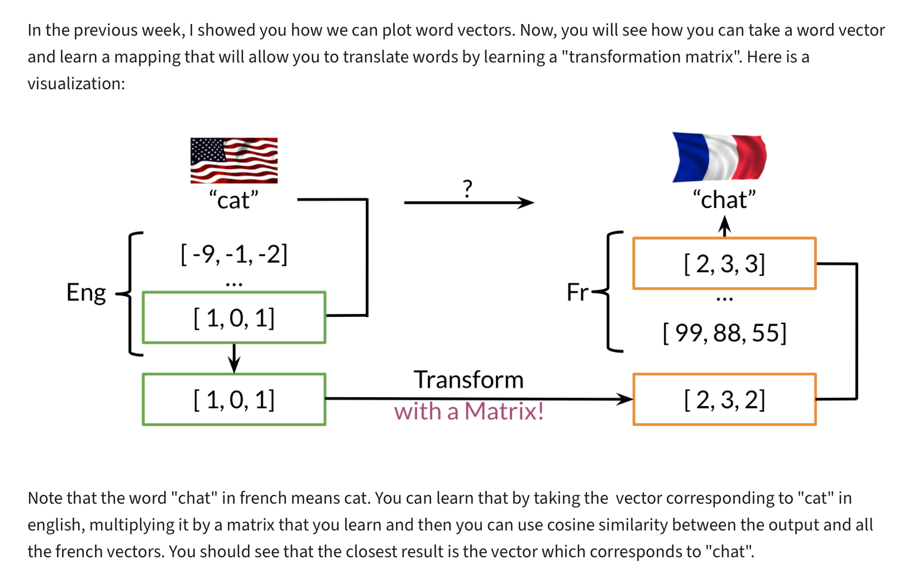
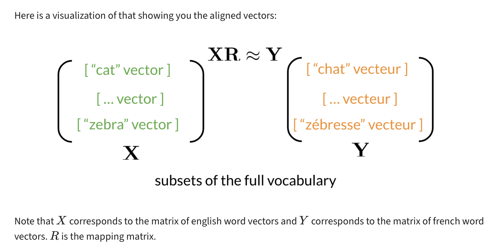
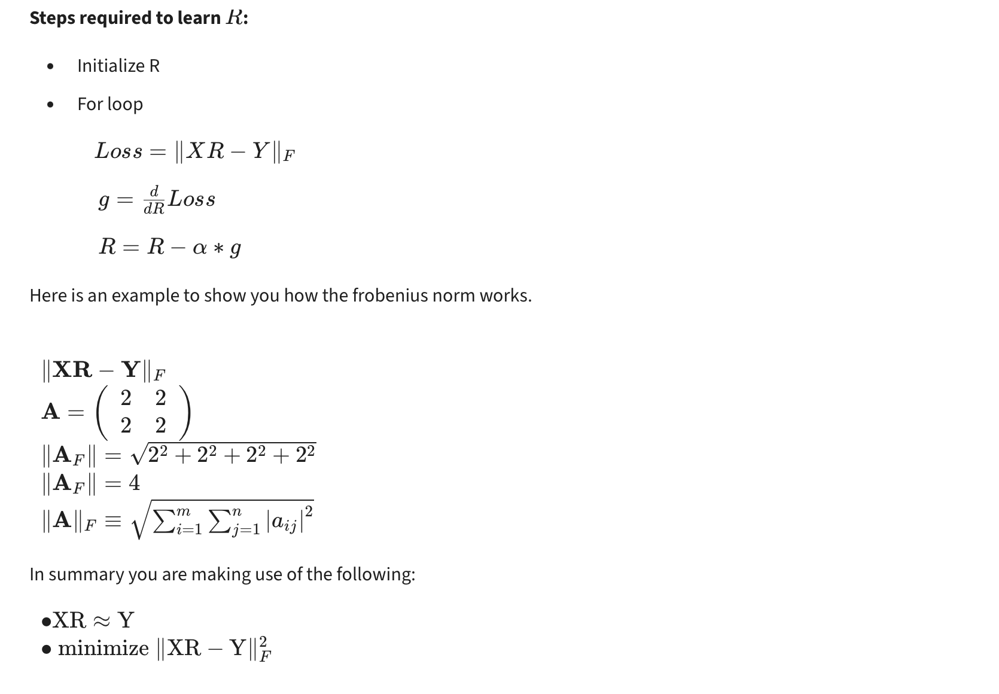
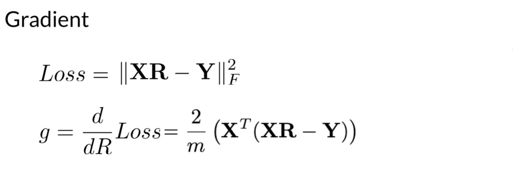

---

## 2. K-nearest Neighbors

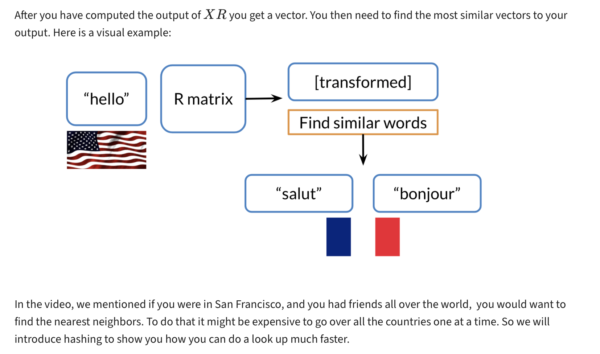

---

## 3. Hash Tables and Hash Functions

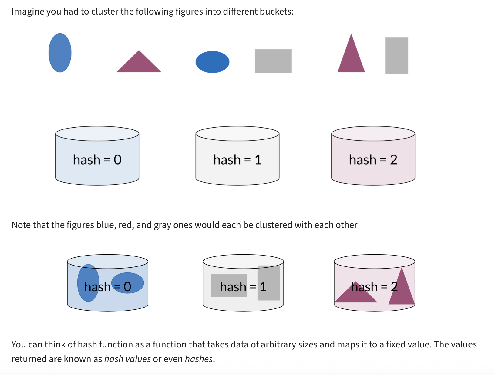
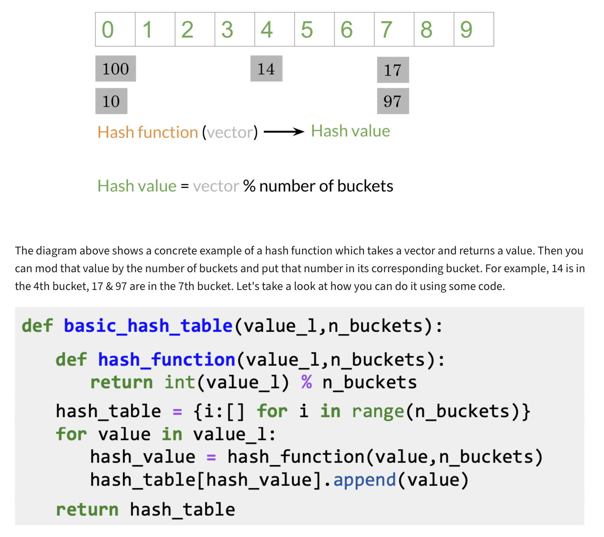
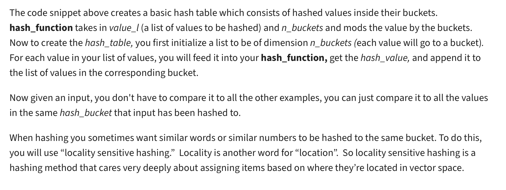

---

## 4. Locality Sensitive Hashing

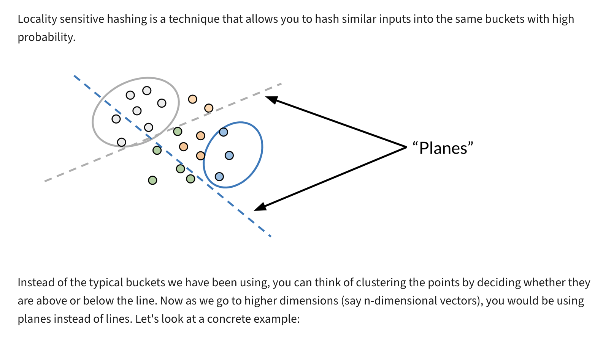
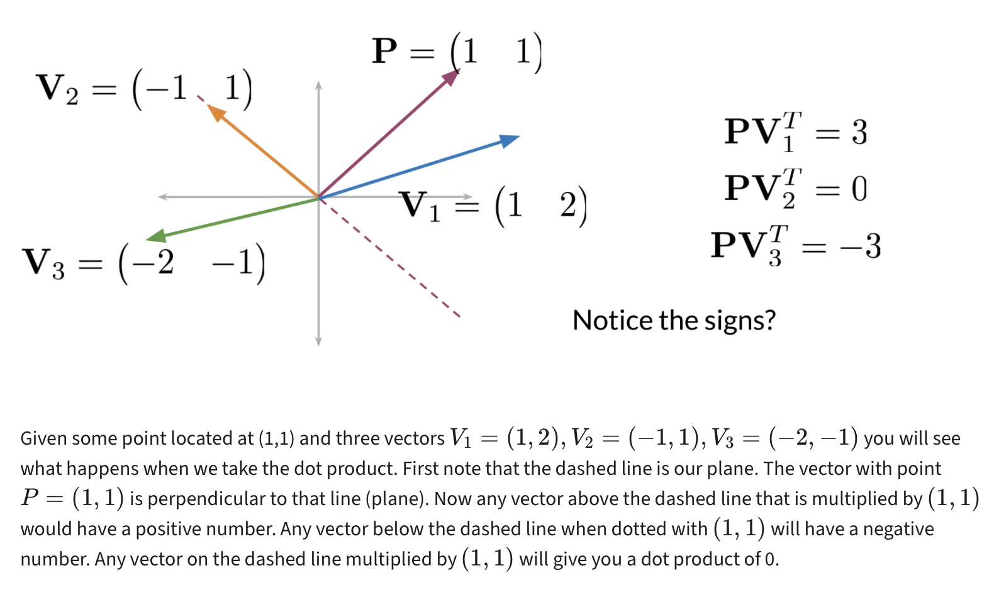
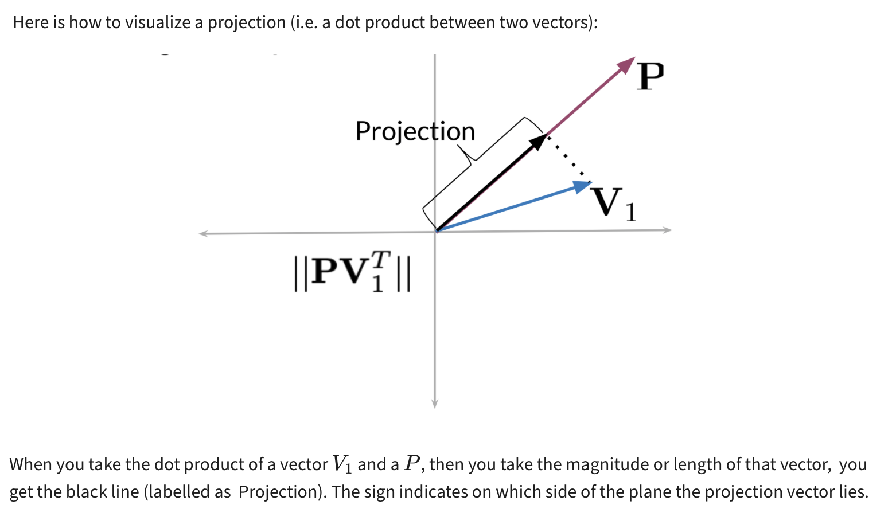
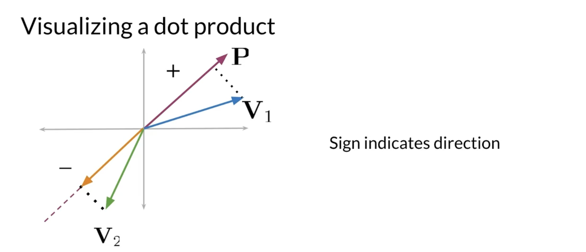

---

## 5. Multiple Planes

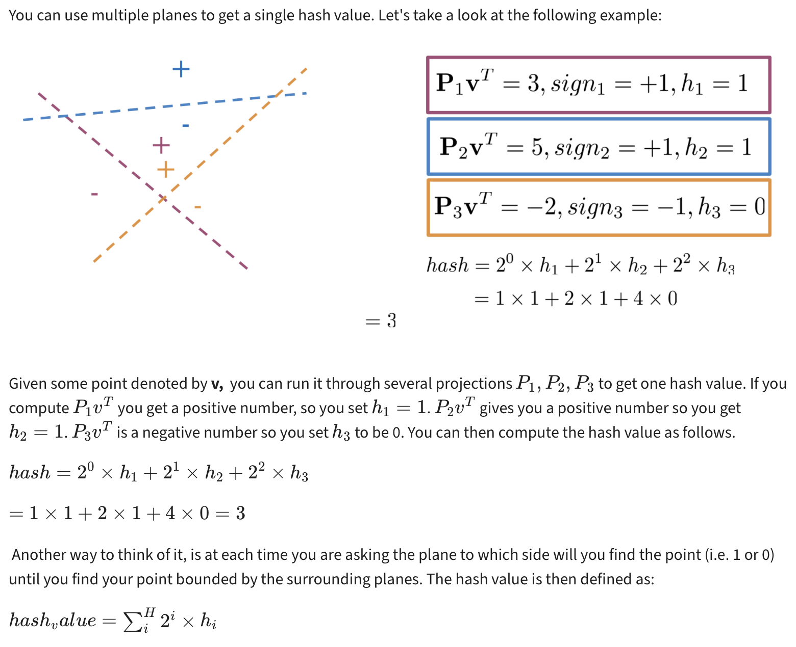
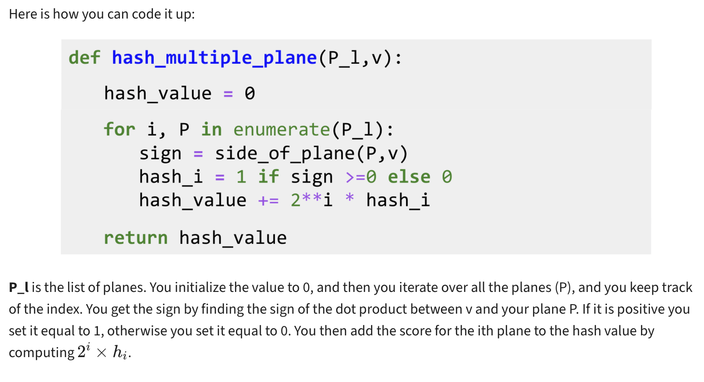

---

## 6. Approximate Nearest Neighbors

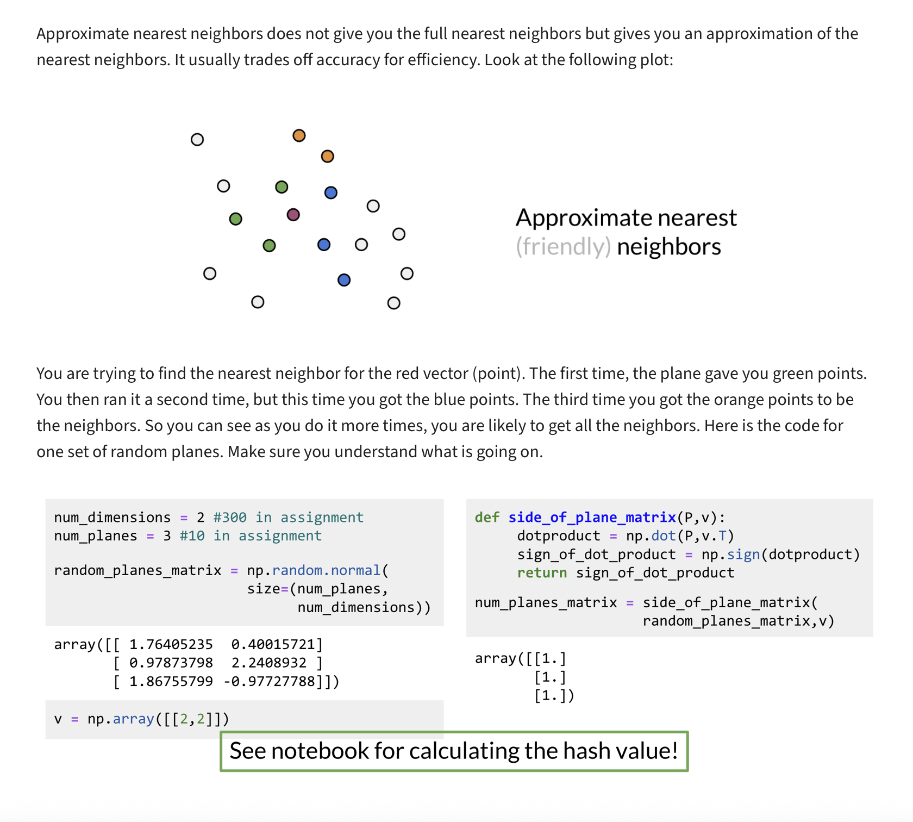

---

## 7. Searching Documents

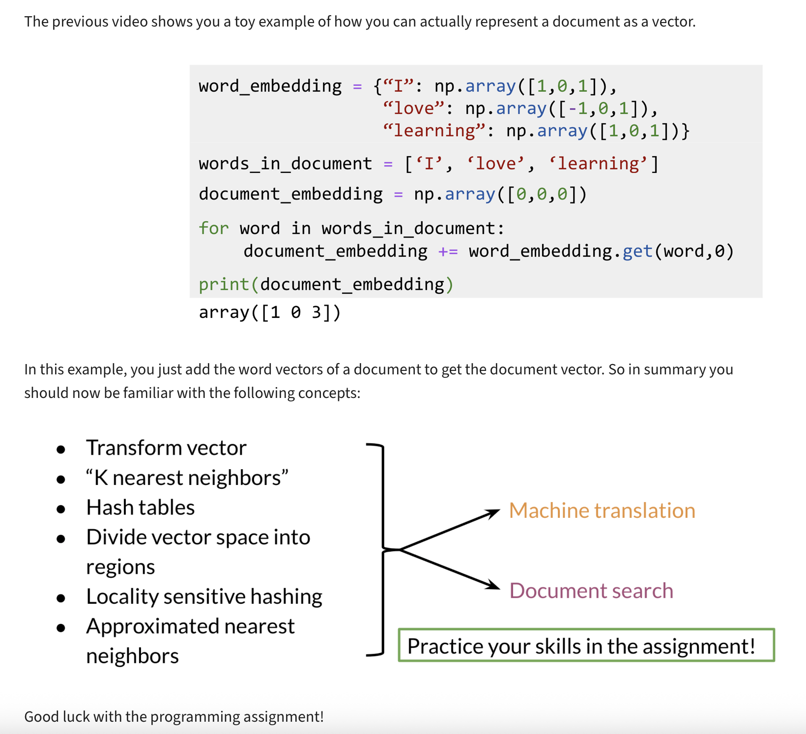
