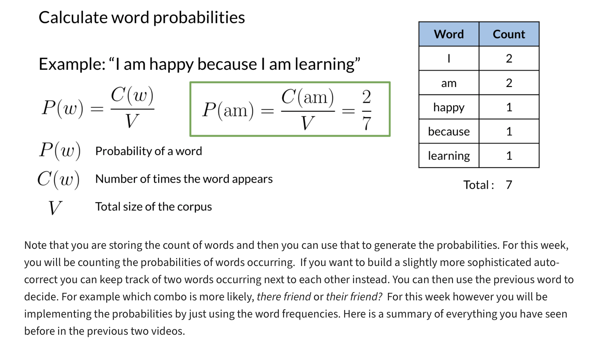

# Week 1: Sentiment Analysis with Logistic Regression

## Course Overview
**Learn about autocorrect, minimum edit distance, and dynamic programming, then build your own spellchecker to correct misspelled words!**  
*Coursera - [DeepLearning.AI](https://www.deeplearning.ai/courses/natural-language-processing-specialization/)*

---

## Learning Objectives
- [x] [Supervised ML & Sentiment Analysis](#1-supervised-ml--sentiment-analysis)

---

## 1. Autocorrect

---

## 2. Building the Model

---

## 3. Minimum Edit Distance

