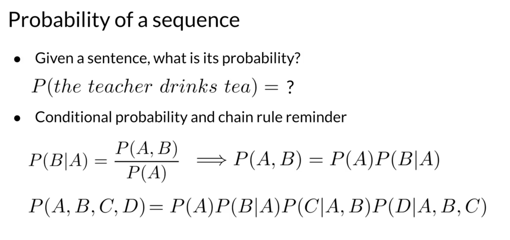
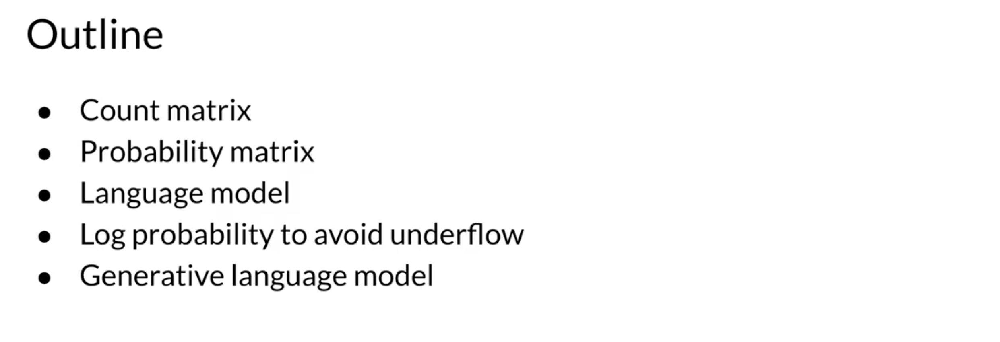

# Week 3: Autocomplete and Language Models

## Course Overview
**Learn about how N-gram language models work by calculating sequence probabilities, then build your own autocomplete language model using a text corpus from Twitter!**  
*Coursera - [DeepLearning.AI](https://www.deeplearning.ai/courses/natural-language-processing-specialization/)*

---

## Learning Objectives
- [x] [N-grams Overview](#1-ngrams-overview)
- [x] [N-grams and Probabilities](#2-ngrams-and-probabilities)
- [x] [Sequence Probabilities](#3-sequence-probabilities)
- [x] [Starting and Ending Sequences](#4-starting-and-ending-sequences)
- [x] [The N-gram Language Model](#5-the-ngram-language-model)
- [x] [Language Model Evaluation](#6-language-model-evaluation)
- [x] [Out of Vocabulary Words](#7-out-of-vocabulary-words)
- [x] [Smoothing](#8-smoothing)
- [x] [Summary](#9-summary)

---

## 1. N-grams Overview

---

## 2. N-grams and Probabilities

---

## 3. Sequence Probabilities

---

## 4. Starting and Ending Sequences

   

---

## 5. The N-gram Language Model

---

## 6. Language Model Evaluation

---

## 7. Out of Vocabulary Words

---

## 8. Smoothing

---

## 9. Summary

