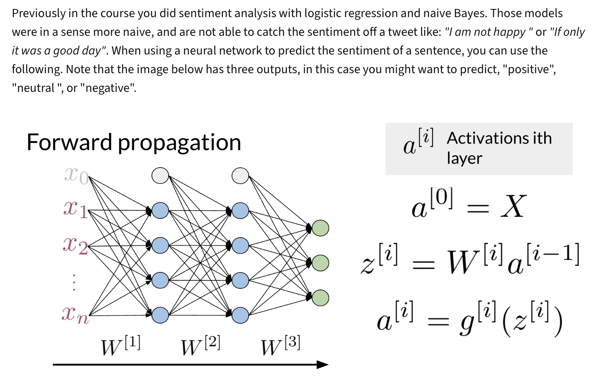
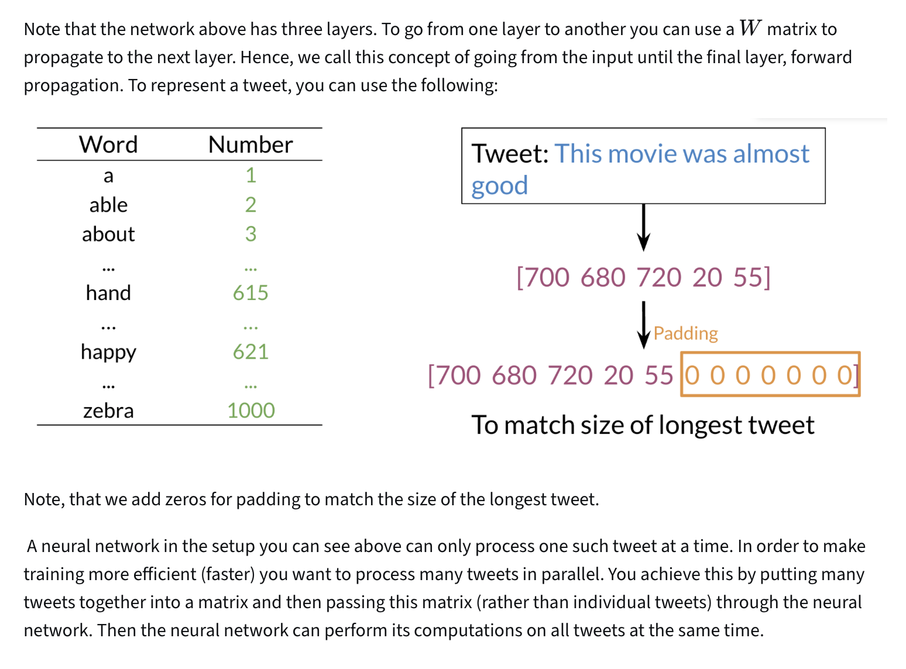
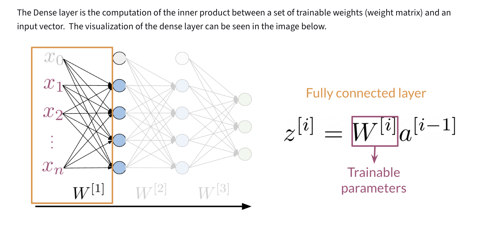
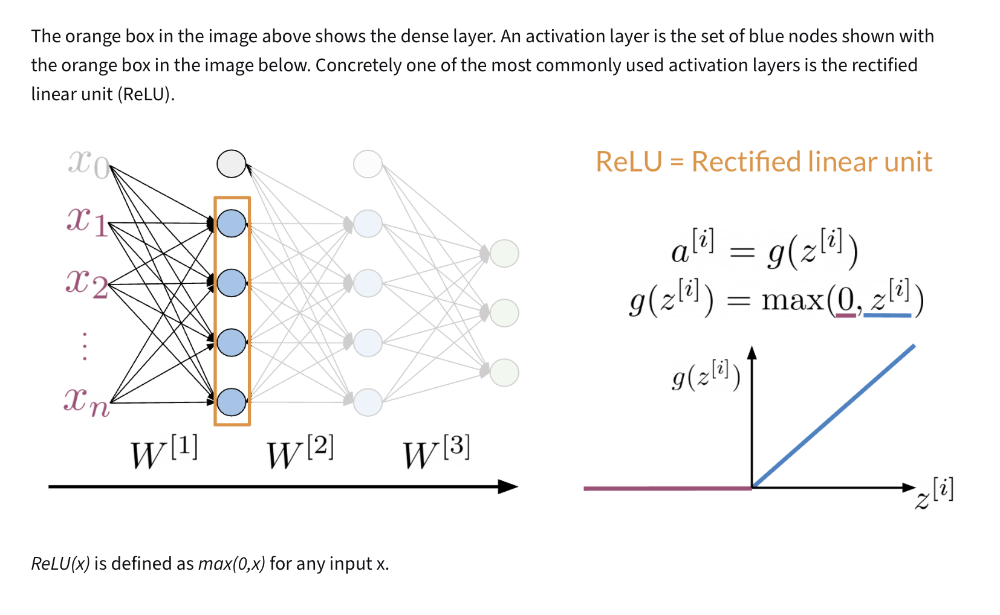
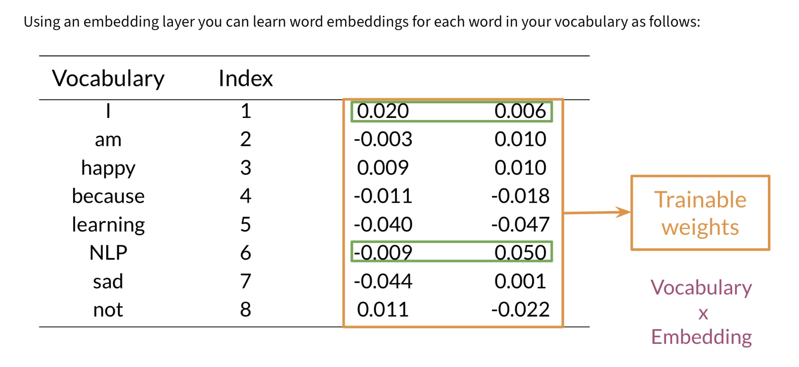
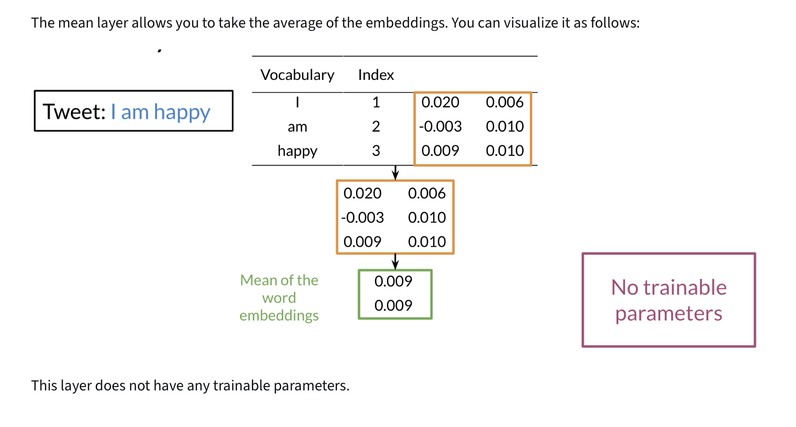
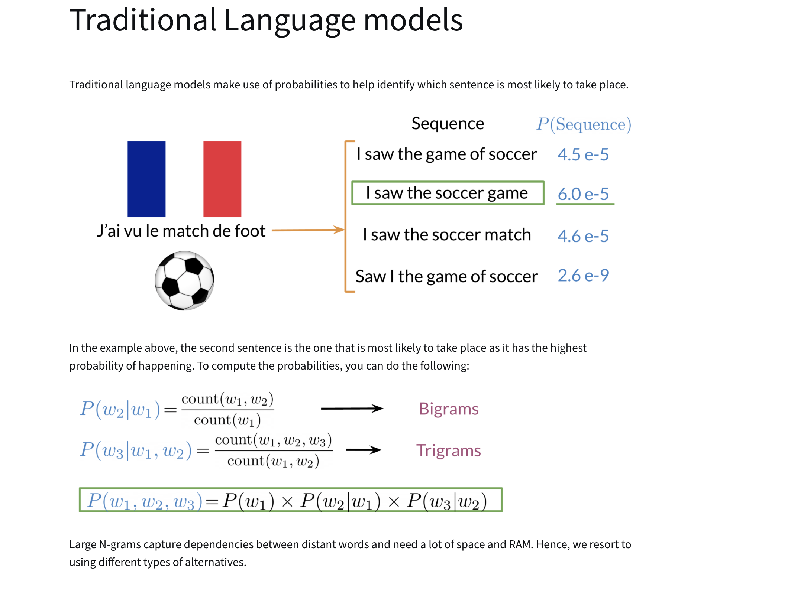

# Week 1: Recurrent Neural Networks for Language Modeling

## Course Overview
**Learn about the limitations of traditional language models and see how RNNs and GRUs use sequential data for text prediction. Then build your own next-word generator using a simple RNN on Shakespeare text data!**  
*Coursera - [DeepLearning.AI](https://www.deeplearning.ai/courses/natural-language-processing-specialization/)*

---

## Learning Objectives
- [x] [Supervised ML & Sentiment Analysis](#1-supervised-ml--sentiment-analysis)

---

## 1. Introduction to Neural Networks and TensorFlow

### 1.1 Neural Networks for Sentiment Analysis

---

### 1.2 Dense Layers and ReLU

---

### 1.3 Embedding and Mean Layers

---

## 2. N-grams vs. Sequence Models

### 2.1 Traditional Language Models

