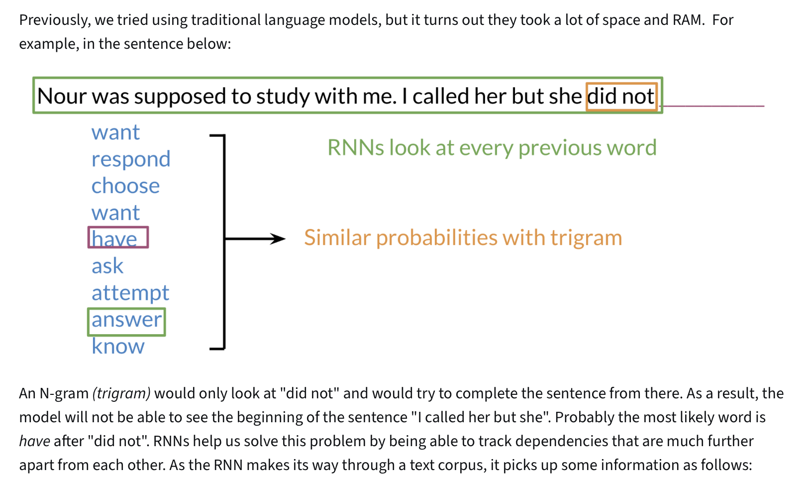
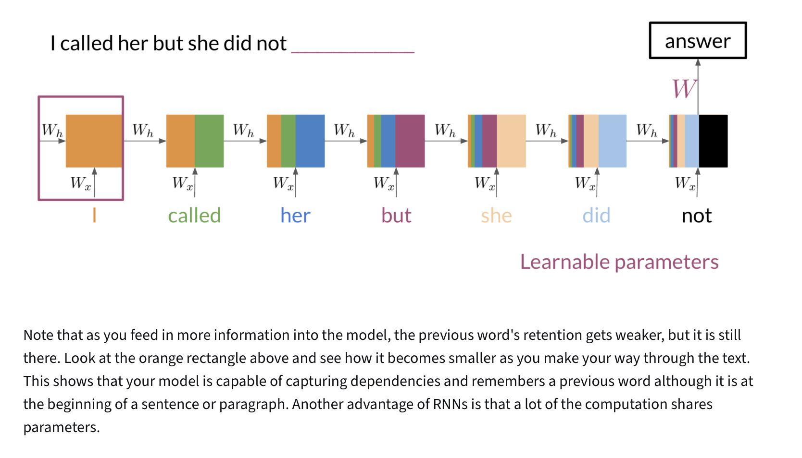
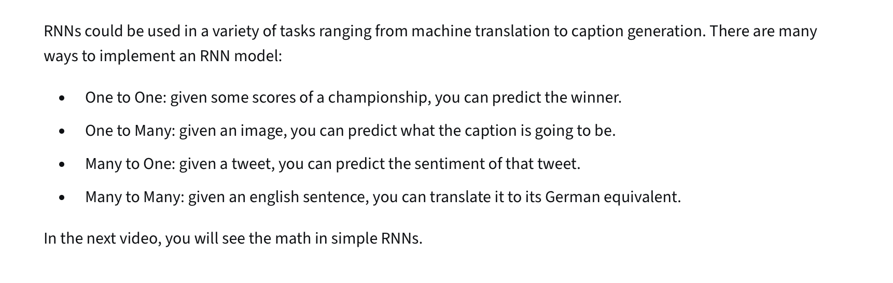
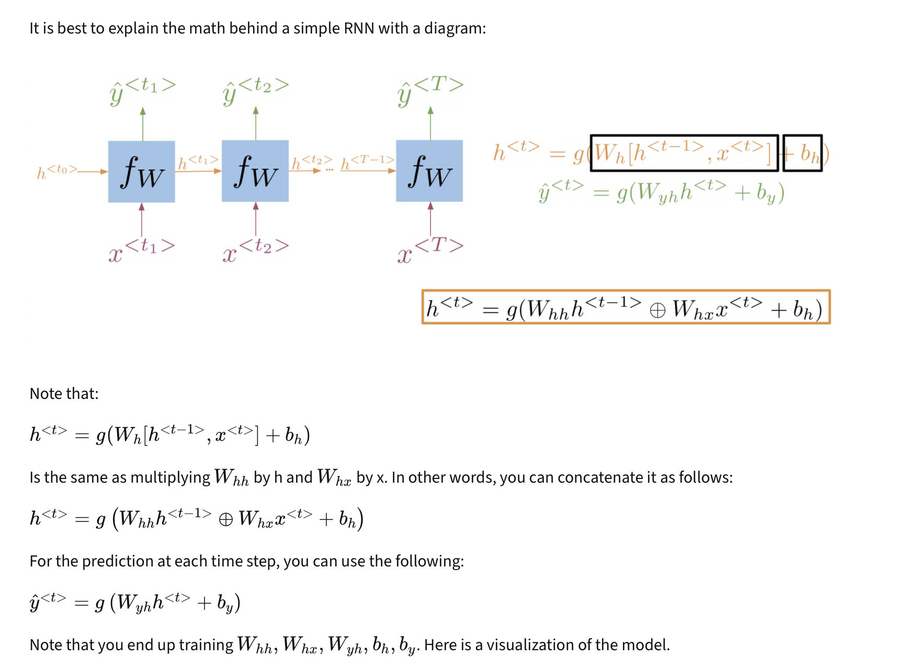
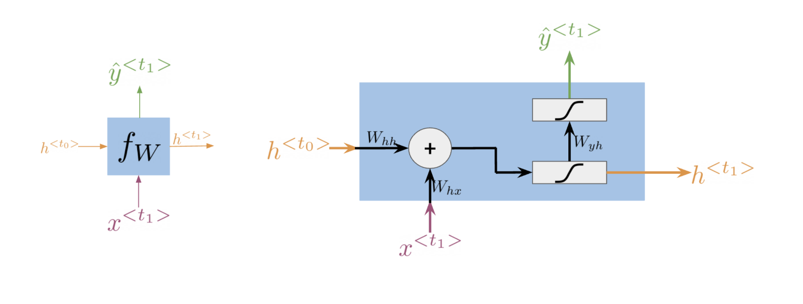
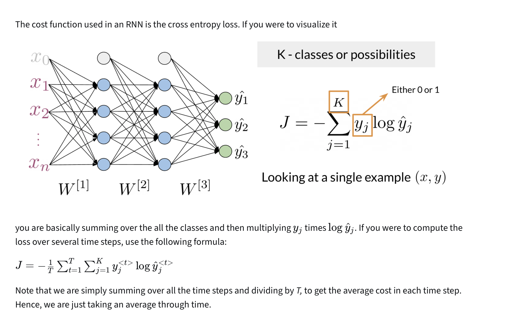
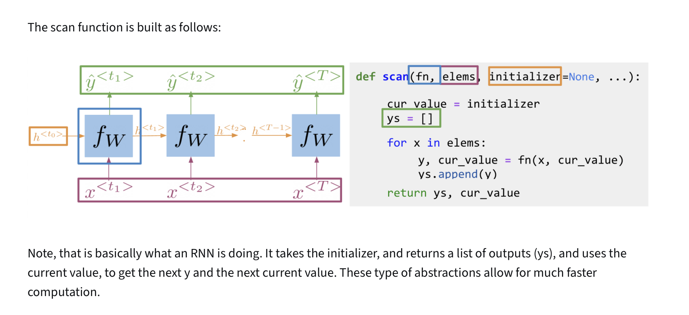
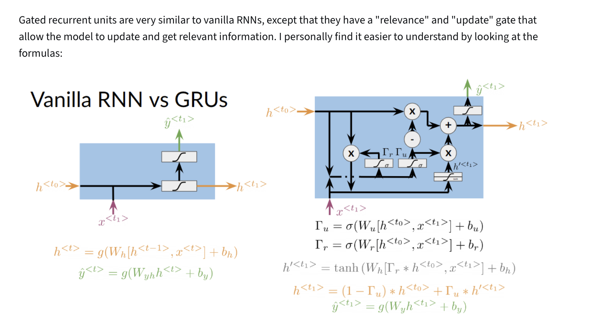
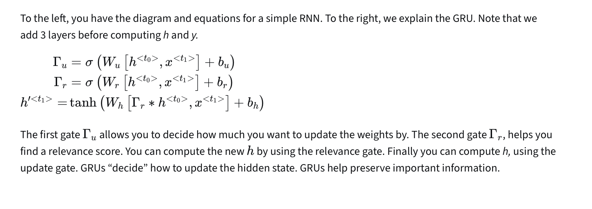
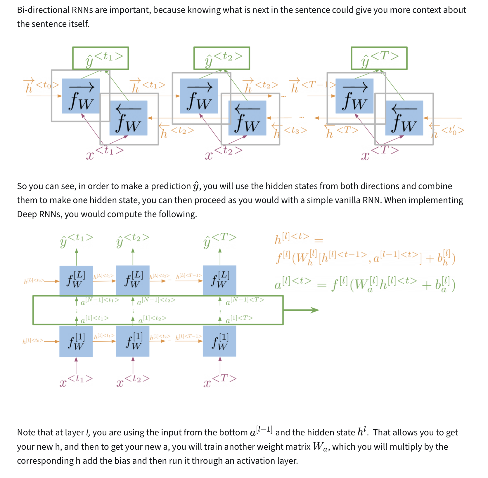

# Week 1: Recurrent Neural Networks for Language Modeling

## Course Overview
**Learn about the limitations of traditional language models and see how RNNs and GRUs use sequential data for text prediction. Then build your own next-word generator using a simple RNN on Shakespeare text data!**  
*Coursera - [DeepLearning.AI](https://www.deeplearning.ai/courses/natural-language-processing-specialization/)*

---

## Learning Objectives
- [x] [Introduction to Neural Networks and TensorFlow](#1-introduction-to-neural-networks-and-tensorflow)
  - [x] [Neural Networks for Sentiment Analysis](#11-neural-networks-for-sentiment-analysis)
  - [x] [Dense Layers and ReLU](#12-dense-layers-and-relu)
  - [x] [Embedding and Mean Layers](#13-embedding-and-mean-layers)
- [x] [N-grams vs. Sequence Models](#2-n-grams-vs-sequence-models)
  - [x] [Traditional Language Models](#21-traditional-language-models)
  - [x] [Recurrent Neural Networks](#22-recurrent-neural-networks)
  - [x] [Applications of RNNs](#23-applications-of-rnns)
  - [x] [Math in Simple RNNs](#24-math-in-simple-rnns)
  - [x] [Cost Function for RNNs](#25-cost-function-for-rnns)
  - [x] [Implementation Notes](#26-implementation-notes)
  - [x] [Gated Recurrent Units (GRUs)](#27-gated-recurrent-units-grus)
  - [x] [Deep and Bidirectional RNNs](#28-deep-and-bidirectional-rnns)

---

## 1. Introduction to Neural Networks and TensorFlow

### 1.1 Neural Networks for Sentiment Analysis

---

### 1.2 Dense Layers and ReLU

---

### 1.3 Embedding and Mean Layers

---

## 2. N-grams vs. Sequence Models

### 2.1 Traditional Language Models

### 2.2 Recurrent Neural Networks

### 2.3 Applications of RNNs

### 2.4 Math in Simple RNNs

### 2.5 Cost Function for RNNs

### 2.6 Implementation Notes

### 2.7 Gated Recurrent Units (GRUs)

### 2.8 Deep and Bidirectional RNNs

