# Week 2: LSTMs and Named Entity Recognition

## Course Overview
**Learn about how long short-term memory units (LSTMs) solve the vanishing gradient problem, and how Named Entity Recognition systems quickly extract important information from text. Then build your own Named Entity Recognition system using an LSTM and data from Kaggle!**  
*Coursera - [DeepLearning.AI](https://www.deeplearning.ai/courses/natural-language-processing-specialization/)*

---

## Learning Objectives
- [x] [RNN and Vanishing Gradients](#1-rnn-and-vanishing-gradients)
- [x] [Introduction to LSTMs](#2-introduction-to-lstms)
- [x] [LSTM Architecture](#3-lstm-architecture)
- [x] [Intro to Named Entity Recognition](#4-intro-to-named-entity-recognition)
- [x] [Training NERs: Data Processing](#5-training-ners-data-processing)
- [x] [Computing Accuracy](#6-computing-accuracy)   

---

## 1. RNN and Vanishing Gradients

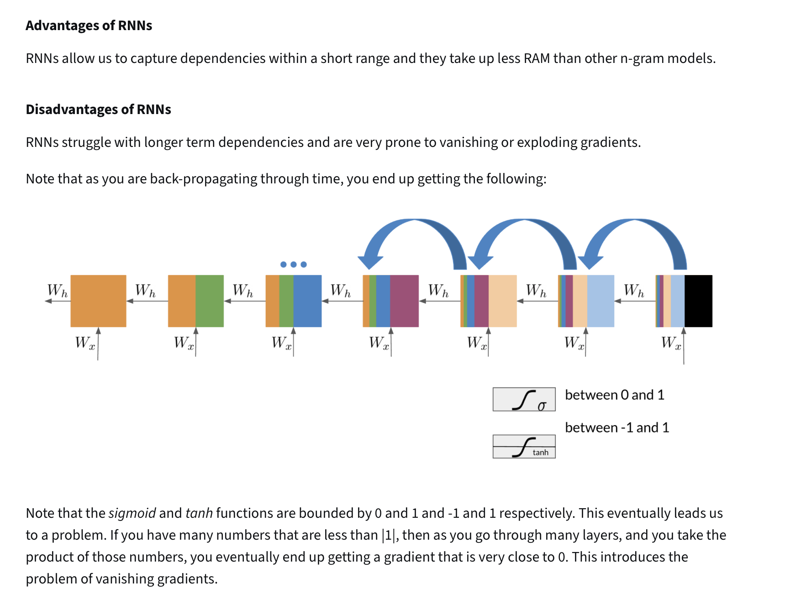
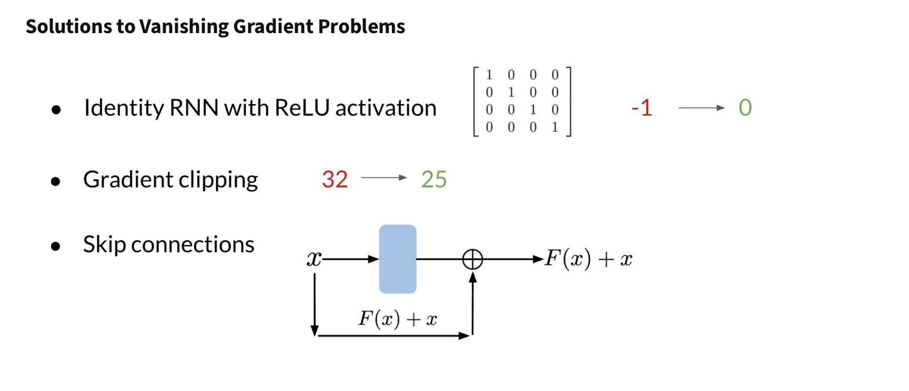

---

## 2. Introduction to LSTMs
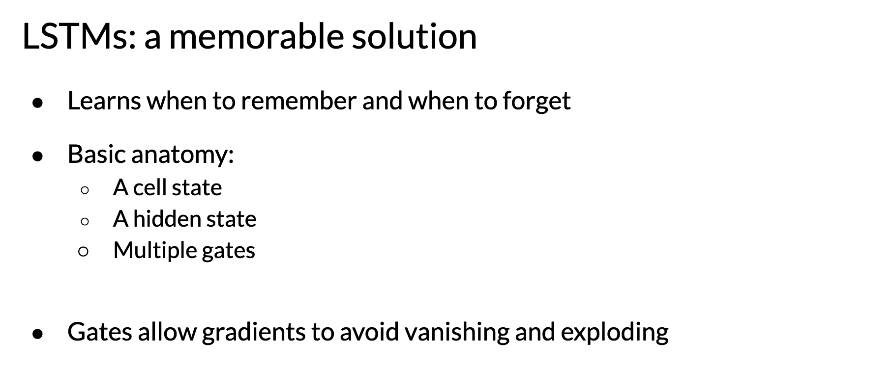
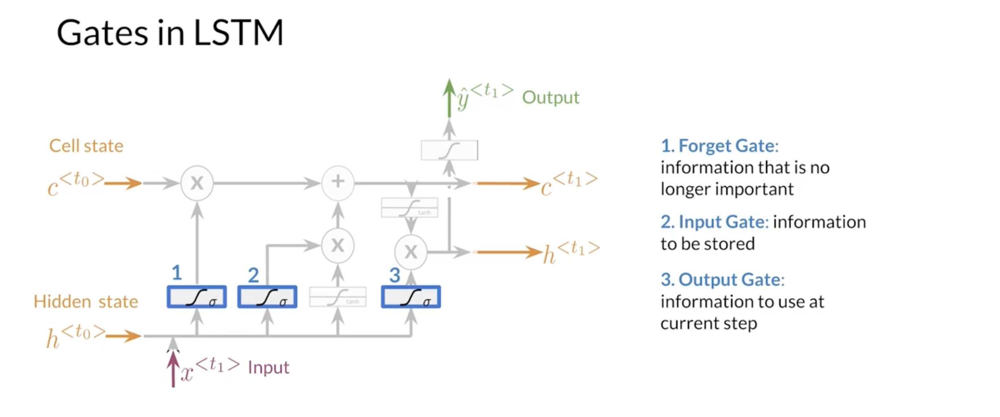

---

## 3. LSTM Architecture
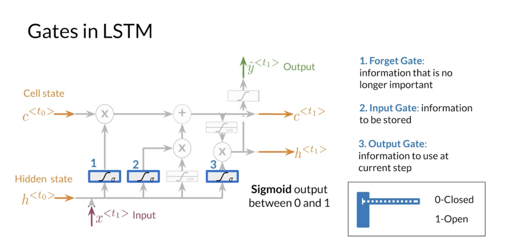
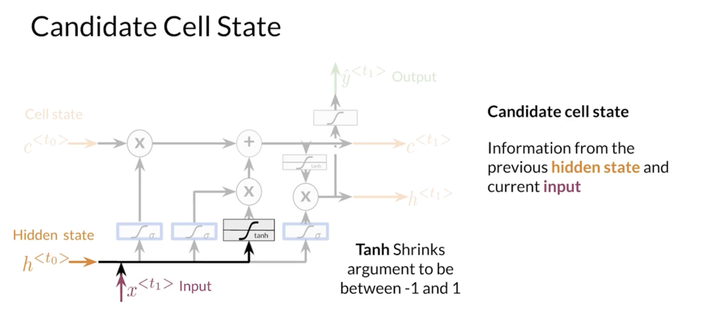
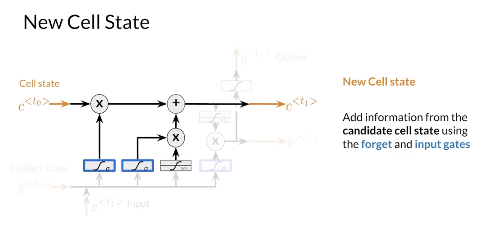
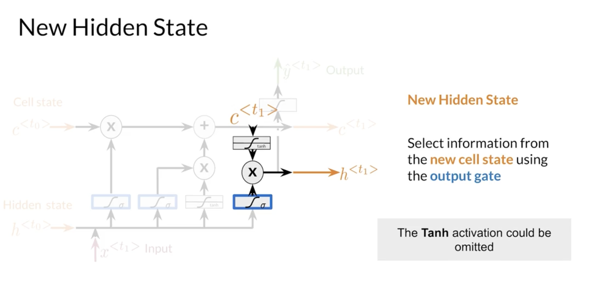
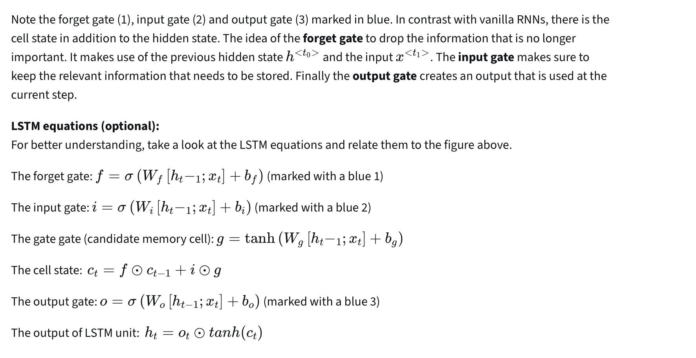

---

## 4. Intro to Named Entity Recognition
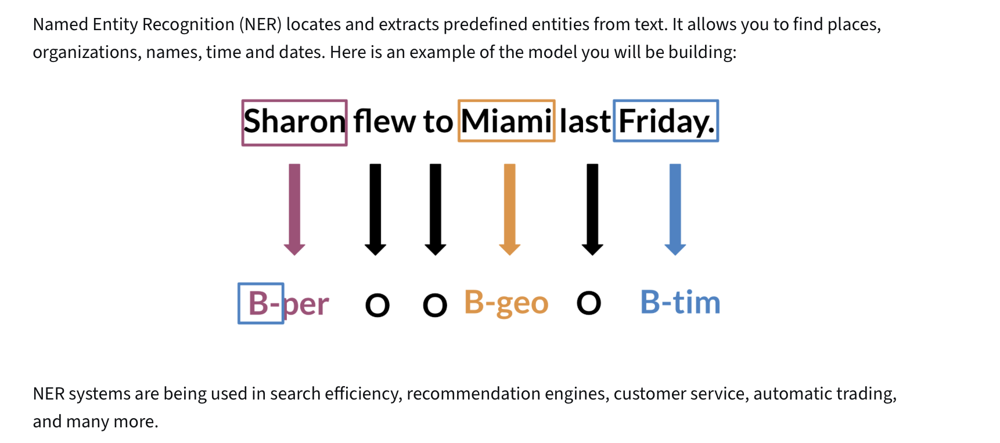

---

## 5. Training NERs: Data Processing
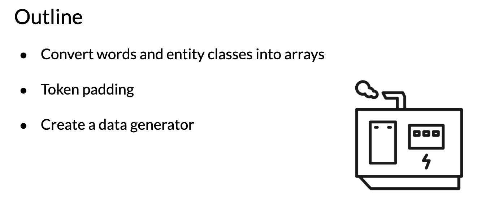
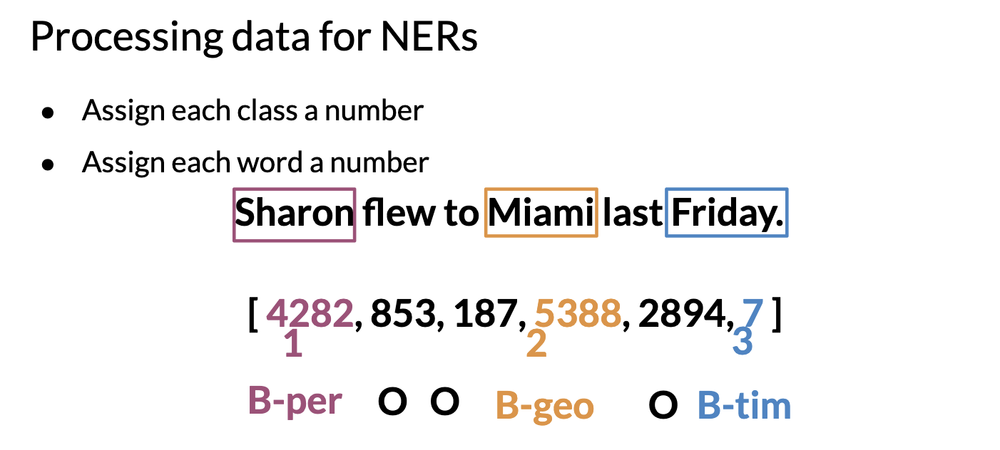
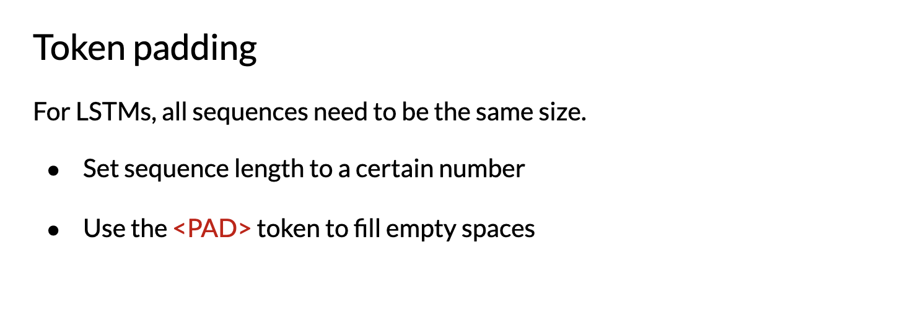
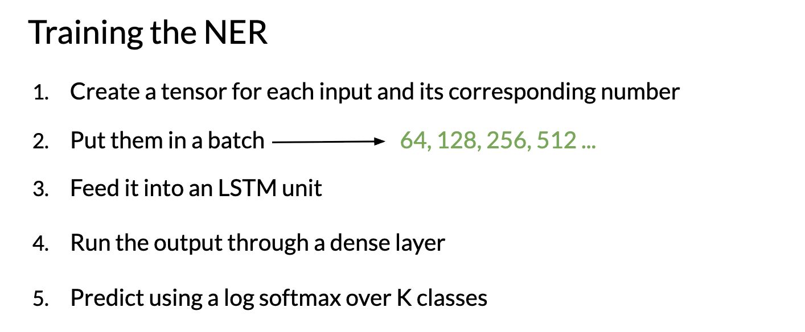
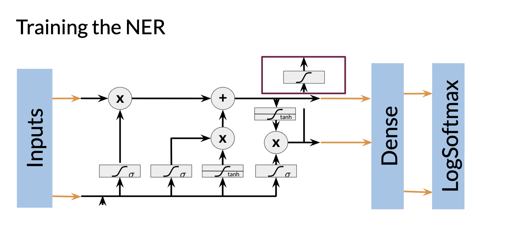

---

## 6. Computing Accuracy
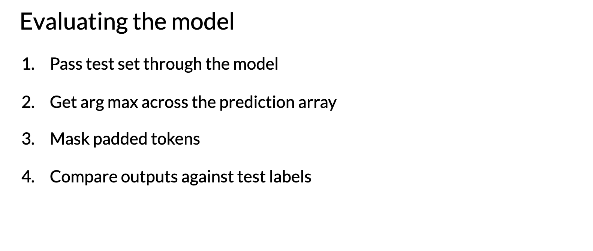
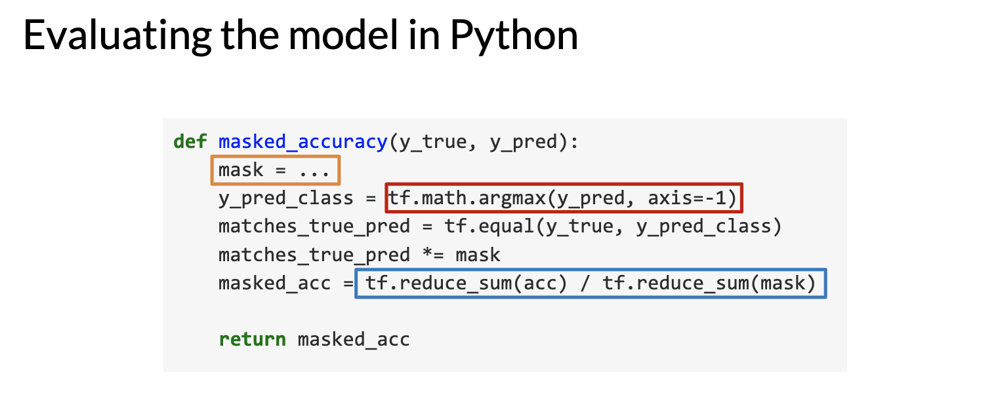
