# Week 3: Siamese Networks

## Course Overview
**Learn about Siamese networks, a special type of neural network made of two identical networks that are eventually merged together, then build your own Siamese network that identifies question duplicates in a dataset from Quora.**  
*Coursera - [DeepLearning.AI](https://www.deeplearning.ai/courses/natural-language-processing-specialization/)*

---

## Learning Objectives
- [x] [Siamese Networks](#1-siamese-networks)
- [x] [Architecture of a Siamese Network](#2-architecture-of-a-siamese-network)

---

## 1. Siamese Networks
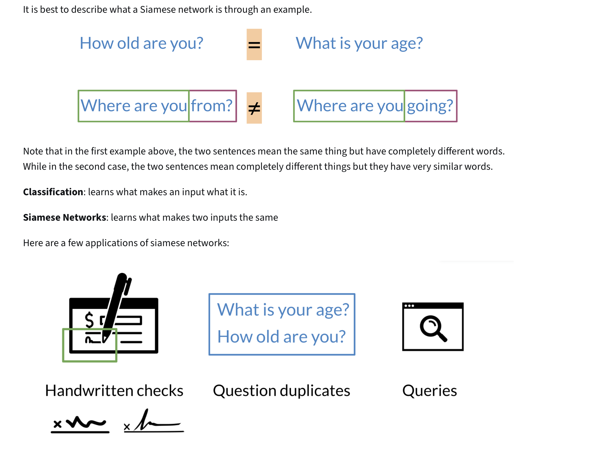

---

## 2. Architecture of a Siamese Network
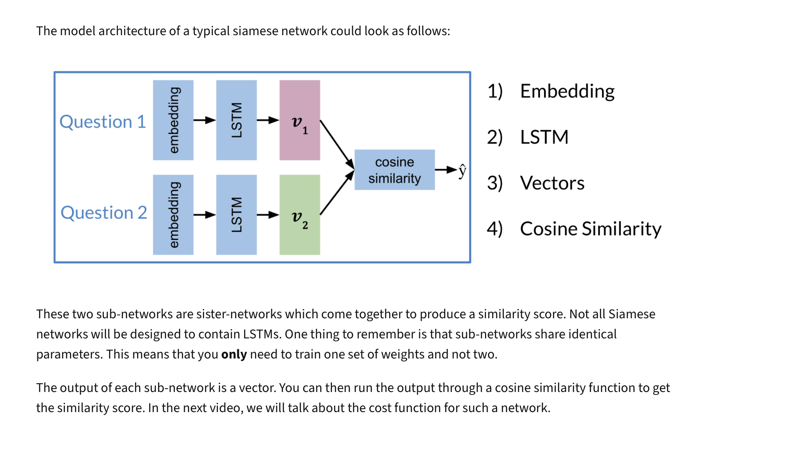

---

## 3. Cost Function
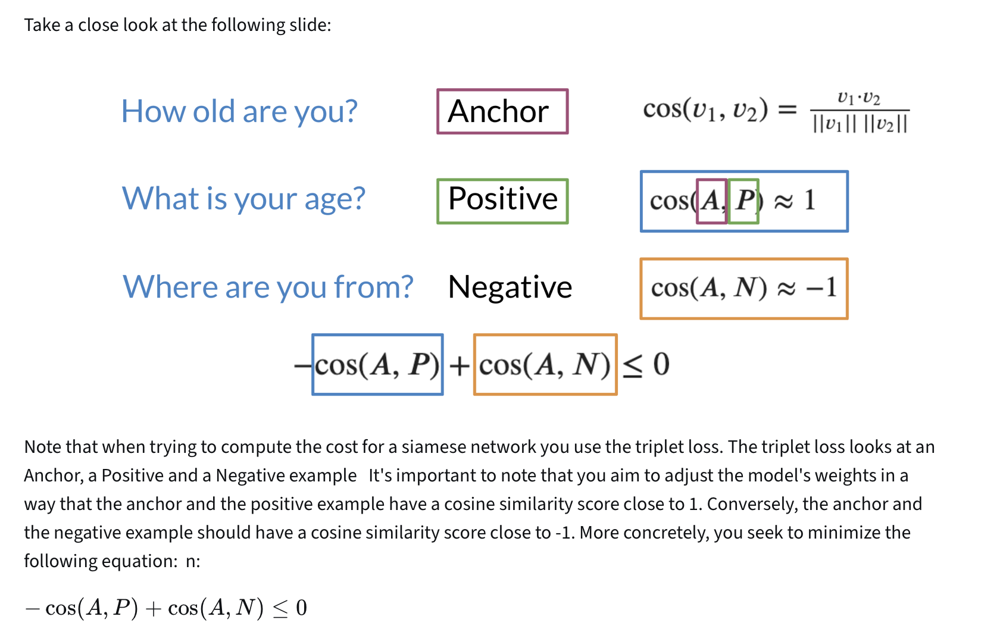
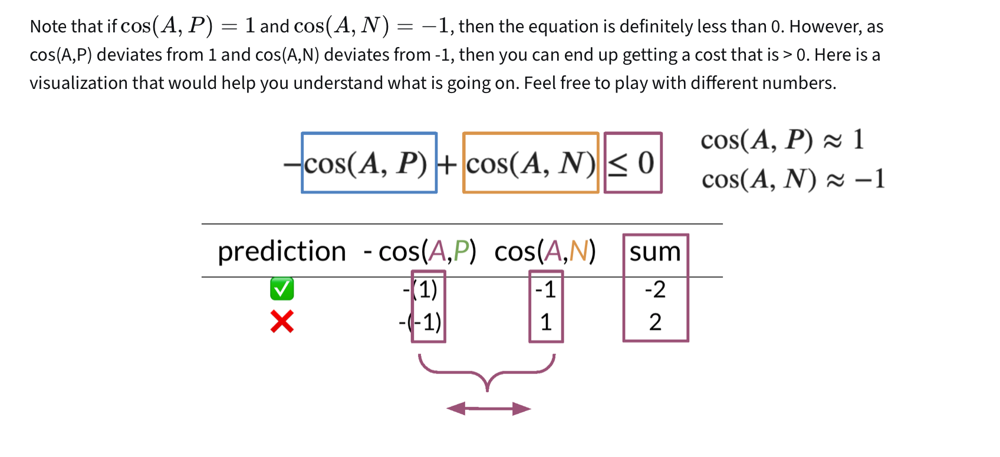

---

## 4. Triplet
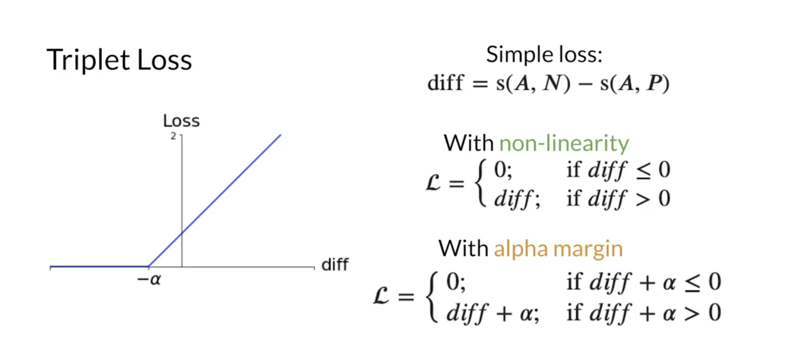
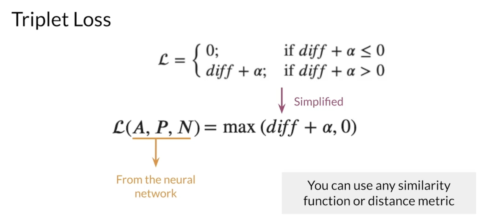
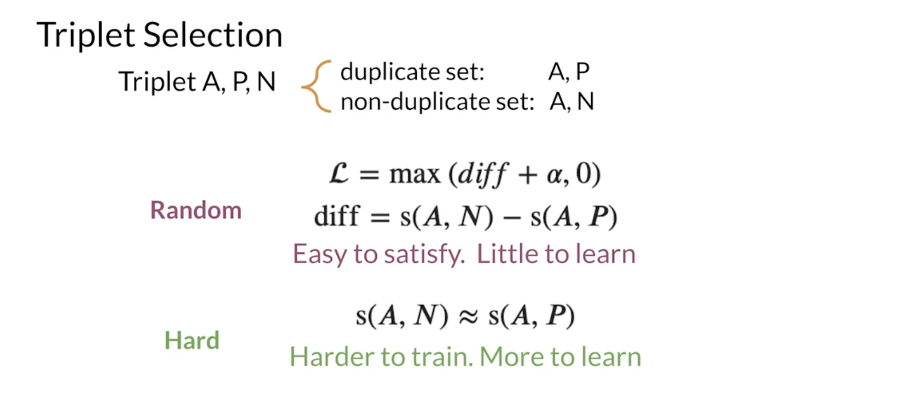
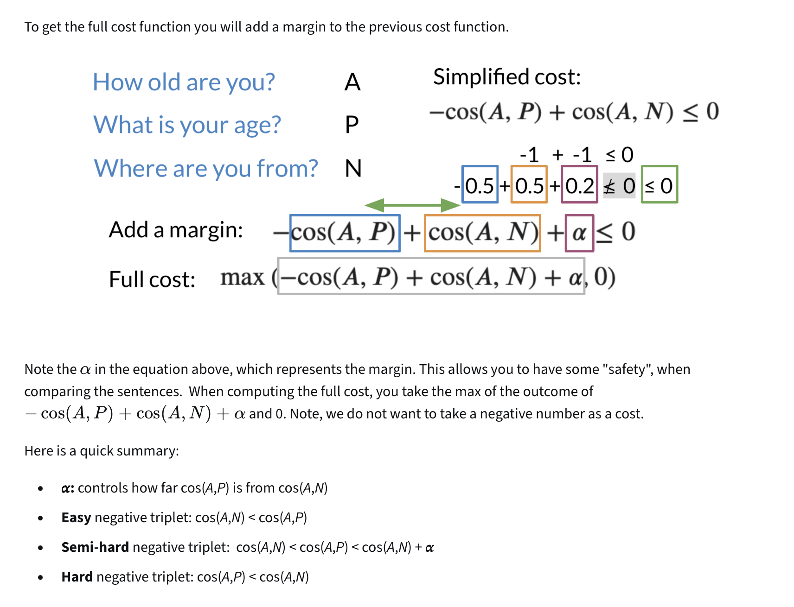

---

## 5. Computing the Cost
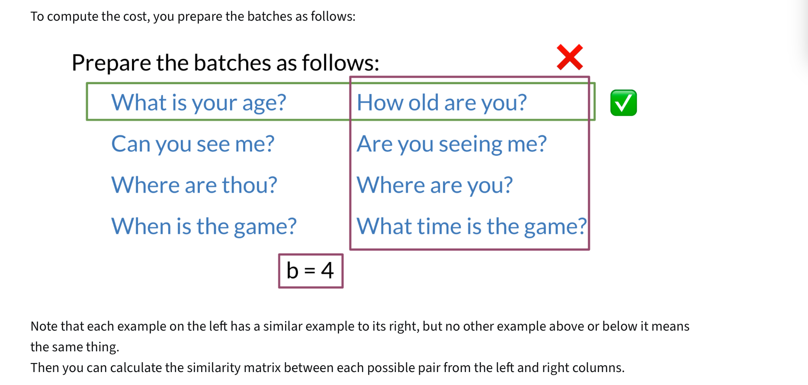
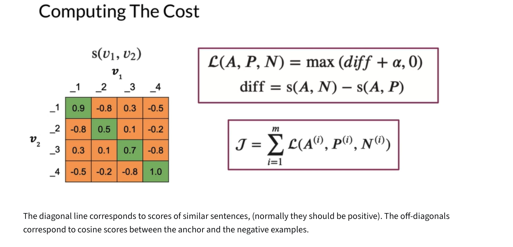
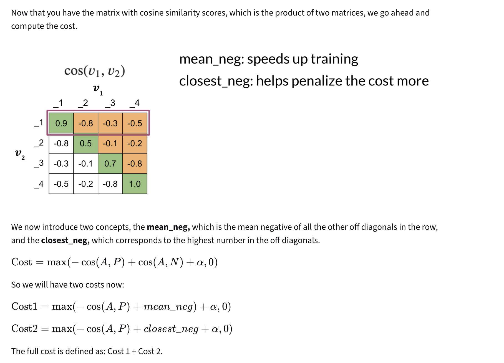
